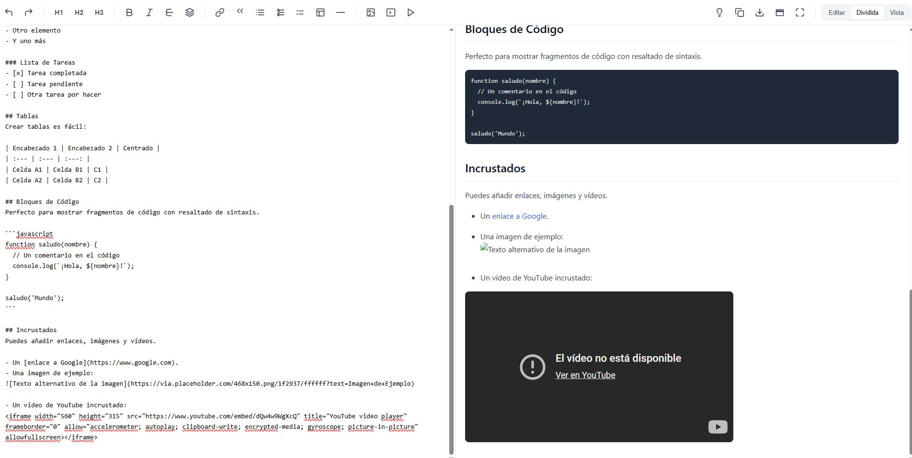

# 📝 Editor Markdown Profesional

Un editor en línea intuitivo y moderno para trabajar con **Markdown** en tiempo real.  
Permite escribir, dar formato, previsualizar y exportar documentos de manera rápida y sencilla.

[Editor Markdown Profesional](https://xococode.github.io/XocoMarkdown/)

---

## 🚀 Características principales

- **Edición en tiempo real** con vista previa instantánea.
- **Barra de herramientas completa** con soporte para:
  - Encabezados (H1, H2, H3)
  - **Negrita**, *Cursiva*, ~~Tachado~~ y <mark>Resaltado</mark>
  - Citas, listas (ordenadas, desordenadas y de tareas)
  - Tablas y líneas horizontales
  - Enlaces, imágenes, vídeos y fragmentos de código
- **Bloques de código con resaltado de sintaxis**.
- **Inserción rápida** de elementos Markdown mediante atajos de teclado:
  - `Ctrl + B` → Negrita
  - `Ctrl + I` → Cursiva
  - `Ctrl + Z / Y` → Deshacer / Rehacer
- **Modo de visualización flexible**:
  - ✏️ Edición
  - 👀 Vista previa
  - 🖥️ Vista dividida
- **Funciones extra de productividad**:
  - Copiar al portapapeles
  - Descargar como `.md`
  - Limpiar editor
  - Pantalla completa
  - Cargar contenido de ejemplo
- **Contador de líneas y caracteres** integrado.

---

## Descargo de Responsabilidad

**Importante:** El uso de este código es bajo total responsabilidad del usuario. ** Xocostudio** no se hace responsable por ningún tipo de mal uso, daño directo o indirecto, pérdida de datos, o cualquier otro perjuicio que pueda derivarse del uso de este software.

### Sin Garantías

El software se proporciona "tal cual", sin garantías de ningún tipo, ya sean expresas o implícitas. Esto incluye, pero no se limita a, las garantías de comerciabilidad, adecuación para un propósito particular y no infracción.

### Exención de Responsabilidad

Los autores no son responsables por cualquier reclamación, daño u otra responsabilidad que surja del uso del software, ya sea en una acción de contrato, agravio o de otra manera, que surja de, fuera de o en conexión con el software o el uso u otros tratos en el software.

### Uso del Código

Al descargar y utilizar este código, aceptas hacerlo bajo tu propio riesgo. Es tu responsabilidad asegurarte de que el software es adecuado para tus necesidades y de tomar todas las precauciones necesarias para evitar posibles daños o pérdidas.

Si tienes alguna pregunta o necesitas más información, por favor contacta a Xocostudio.

---

*¡Gracias por utilizar nuestro software! Asegúrate de leer y entender este descargo de responsabilidad antes de proceder.*

## 📸 Captura de Pantalla

